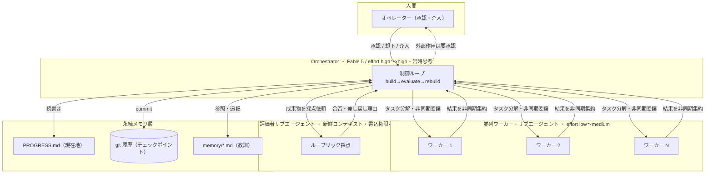
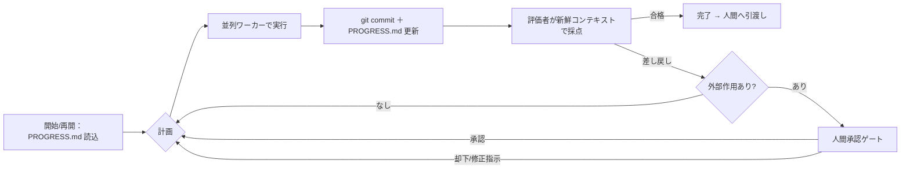

# 共通の土台 — 長時間自律ハーネス 設計図・指示書

> Fable 5 天才的活用10案が共通で乗る再利用可能な基盤。
> 出典パターン: Anthropic「Effective harnesses for long-running agents」＋ Measuring Agent Autonomy。
> 対象読者: 実装者。この文書だけで土台を組めることを目標とする。

このハーネスが提供する4つの部品:
1. **永続メモリ層**（PROGRESS.md ＋ git ＋ memory/*.md）— セッションを跨いで綺麗に再開する
2. **評価者サブエージェント**（新鮮コンテキスト・書込権限なし）— 生成と評価を分離し自己満足バイアスを断つ
3. **並列ワーカー**（orchestrator と非同期集約）— 規模を出す
4. **人間承認ゲート** — 外部作用（非可逆）を人間に留める

---

## 1. 設計図

### 1.1 コンポーネント構成



### 1.2 制御ループ（build → evaluate → rebuild）



### 1.3 なぜこの形か（設計判断）

| 判断 | 理由（リサーチ根拠） |
|---|---|
| 生成（ワーカー）と評価を**別コンテキストに分離** | 自己採点は正に偏る。評価者は「ビルドを見ていない・書込権限なし」で独立採点する（Anthropic） |
| 状態を**ファイル（PROGRESS.md＋git）**に外出し | 各新セッションは前回の記憶を持たず、コンテキスト圧縮は詳細を失う。ファイルなら綺麗に再開できる |
| 1タスクは**数十分〜1時間で完結**する粒度に切る | 80%信頼の実用自律は約1時間で崩れる（METR）。複数日の開放タスクに賭けない |
| **外部作用は人間ゲート**、読み取り・生成は自律 | 非可逆事故を防ぐ。信頼較正は経験で滑らかに増える＝運用ログ自体が先行者優位の資産になる |
| ハーネスは**モデル更新のたびに再簡素化** | handoff/memory 層はモデル能力に最も敏感。新モデルほど足場が要らず、盛り過ぎは次リリースで負債化 |
| **build-vs-buy を先に判断** | Anthropic は本ハーネスの大部分を製品提供済み——Outcomes（ルーブリック採点ループ）・scheduled deployments（夜間cron）・memory stores（外部脳）。ホスティング不要・工数最小なら Managed Agents を「買う」。実行環境の完全制御・モデル非依存の可搬性・細かなコスト制御（キャッシュ/Batches/モデル段付け）が要るときだけ本ハーネスを「組む」。無自覚な車輪の再発明をしない |

---

## 2. ファイルレイアウト

```
repo/
├─ PROGRESS.md                # 現在地（毎ステップ更新・下記テンプレ）
├─ memory/                    # 教訓の蓄積（1教訓=1ファイル・先頭に要約1行）
│  ├─ INDEX.md                # 教訓の目次（夜間ジョブが自動更新）
│  └─ lesson-*.md
├─ .harness/
│  ├─ config.yaml             # モデル/effort/権限/ゲート方針
│  ├─ rubric.md               # 評価者が使う合否ルーブリック（案ごとに差替）
│  └─ gate-policy.md          # 人間承認が要るアクション一覧
├─ prompts/
│  ├─ orchestrator.md         # オーケストレーター system prompt
│  ├─ worker.md               # ワーカー prompt テンプレ
│  ├─ evaluator.md            # 評価者 system prompt
│  └─ memory-consolidation.md # 夜間の記憶再整理ジョブ prompt
└─ artifacts/                 # 成果物の出力先
```

### 2.1 PROGRESS.md テンプレート

```markdown
# 目標
<このランで達成する「1時間で完結する」明確なゴール。Outcome/合格条件を1行で>

## 完了したこと
- [x] <検証済みの事実のみ。ツール結果で裏づけできるものだけ書く>

## 次にやること
- [ ] <直近の1〜3手>

## 決定 log（前提と結果を対で）
- 決定: <何を決めたか> / 前提: <その時の前提> / 結果: <後で埋める>

## 未解決・ブロッカー
- <人間に判断を仰ぐ点／外部承認待ち>
```

---

## 3. 指示書（各エージェントの仕様）

### 3.1 役割 × モデル × effort × 権限

| 役割 | モデル | effort | 思考 | ツール権限 |
|---|---|---|---|---|
| **Orchestrator** | `claude-fable-5`（または `claude-opus-4-8`） | high（最難所のみ xhigh / max） | 常時ON（Fableは自動） | フル（Read/Write/Edit/Bash/git/サブエージェント起動） |
| **Worker（並列）** | Opus 4.8 / Sonnet 5 | low 〜 medium | adaptive | サブタスクにスコープ（Read＋当該作業のみ。共有resourceへの書込は不可） |
| **Evaluator（評価者）** | Opus 4.8 / Fable 5 | high | adaptive | **読み取り専用**（Read/Grep/Glob のみ。Write/Edit/破壊的Bashを与えない） |
| **記憶再整理（夜間）** | Fable 5 / Opus 4.8 | high | 常時ON | memory/ への読書きのみ |

> Fable 5 は `thinking` パラメータを送らない（常時ON）。`thinking:{type:"disabled"}` は 400。深さは `output_config.effort` で制御。長時間ランは `task_budget`（beta `task-budgets-2026-03-13`, 最小20k）で暴走を抑える。

### 3.2 Orchestrator system prompt（雛形）

```
あなたは長時間自律タスクのオーケストレーターです。目標は PROGRESS.md の「目標」に書かれた1つのゴールを、合格ルーブリック（.harness/rubric.md）を満たすまで完遂することです。

# 手順
1. まず PROGRESS.md と memory/INDEX.md を読み、現在地と過去の教訓を把握する。
2. 独立に並列化できるサブタスクは、ワーカーサブエージェントへ非同期に委譲し、待ちで詰まらず自分は先に進む。ワーカーが逸れていたら介入する。
3. 意味のある1手ごとに git commit し、PROGRESS.md を更新する（完了・次・決定log）。
4. 成果物ができたら、必ず評価者サブエージェントに採点を依頼する（自分では合否判定しない）。差し戻し理由に沿って修正し、合格までループする。
5. 外部作用（送信・書込み・課金・削除・本番反映・共有ブランチへのpush）は絶対に自分で実行せず、人間承認ゲートに回す。

# 記憶
- 進捗・決定は必ずファイル（PROGRESS.md, git）に書く。頭の中だけに残さない。
- 再利用可能な教訓は memory/ に1教訓1ファイルで追記する（先頭に要約1行）。

# 振る舞い
- 十分な情報が集まったら動く。既に決まったことを蒸し返さない。選ばない選択肢を長々と述べない（提案する時は網羅列挙でなく推奨を1つ）。※これは思考ブロックには適用しない。
- 進捗を報告する前に、各主張をこのセッションのツール結果で裏づけできるか確認する。裏づけのない claim は「未検証」と明示する。テストが落ちたらそう言う。完了・検証済みなら率直に「完了」と書く。
- あなたは自律運用中で、人間は常時見ていない。原依頼から順当に follow する可逆アクションは、確認を求めず実行する。ターンを終える前に最後の段落を点検し、それが「計画・質問・約束」で未実行なら今ツールで実行する。完了かユーザー判断待ちのときだけターンを終える。
```

### 3.3 Evaluator（評価者）system prompt（雛形）

```
あなたは成果物の独立評価者です。ビルドの過程は見ていません。目的は成果物を .harness/rubric.md の各項目に照らして厳しく採点し、合否と差し戻し理由を返すことです。

# 制約
- あなたには書込・編集・実行の権限はない。読み取りのみで判断する。
- 生成者の意図を忖度しない。ルーブリックの各項目を独立に、反証を試みる姿勢で評価する（「これは要件Xを満たさない可能性はないか?」を各項目で問う）。
- 迷ったら不合格側に倒す。曖昧な合格より、具体的な差し戻し理由の方が価値がある。

# 出力（JSON）
{
  "per_criterion": [{"id":"...", "pass": true/false, "evidence":"根拠となった成果物中の箇所", "reason":"..."}],
  "overall_pass": true/false,
  "must_fix": ["合格に必須の修正を具体的に"]
}
```

### 3.4 Worker（並列ワーカー）prompt テンプレ

```
あなたは限定サブタスクの実行者です。担当は次の1点のみ: <サブタスク定義>。
- 与えられた入力とツールの範囲でのみ作業し、範囲外へ広げない。
- 結果は構造化して返す（要点→根拠→未確定点）。共有状態は書き換えない。返り値がオーケストレーターへの成果物である。
```

### 3.5 記憶再整理ジョブ（夜間）prompt

```
あなたは記憶のメンテナンス担当です。effort=high で memory/ を再整理する:
- 矛盾する教訓を解消する（新しい/検証済みを優先）。
- 重複を統合する。
- 陳腐化した前提（モデル更新・仕様変更で無効化）を失効マークする。
- 各教訓の先頭要約を最新化し、INDEX.md を再生成する。
リポジトリや chat 履歴が既に記録している内容は保存しない。誤りと判明した教訓は削除する。
```

### 3.6 人間承認ゲート方針（.harness/gate-policy.md）

| アクション種別 | 自律可否 |
|---|---|
| 読み取り・検索・分析・成果物のドラフト生成 | ✅ 自律 |
| ローカルの生成・編集・テスト実行・commit | ✅ 自律 |
| **メール/メッセージ送信** | ⛔ 人間承認 |
| **外部システム・DBへの書込み** | ⛔ 人間承認 |
| **課金・決済** | ⛔ 人間承認 |
| **ファイル/データ削除** | ⛔ 人間承認 |
| **共有ブランチへの push・本番反映・デプロイ** | ⛔ 人間承認 |
| **機密・PII を含むデータの外部 API 送信** | ⛔ 人間承認（データ区分判定。Fable 5 は30日データ保持必須・ZDR不可——送ってよい区分か先に判定する） |

> 実装: 外部作用は必ず「カスタムツール（人間が承認して初めて実行）」経由にし、エージェントには生の資格情報を渡さない。credential はホスト側／vault に置き、egress で差し込む。

---

## 4. 実行手順（Run Procedure）

擬似コード（オーケストレーター視点）:

```
state = read("PROGRESS.md"); lessons = read("memory/INDEX.md")
while not done and iterations < MAX and budget_remaining():
    plan = decide_next(state, lessons)
    subtasks = split_parallelizable(plan)
    results = spawn_workers(subtasks)         # 非同期集約・待ちで詰まらない
    apply(results)
    git_commit(); update("PROGRESS.md")
    verdict = ask_evaluator(artifacts, rubric)  # 新鮮コンテキスト・読取専用
    if verdict.overall_pass: done = True
    elif needs_external_action(plan): request_human_gate()  # 承認待ち
    else: state = incorporate(verdict.must_fix)
handoff_to_human(summary, artifacts)
```

夜間常設する場合: cron/deployment で起動し、**「監視・棚卸し・レポート生成・PR下書き」まで**を自律、**アクションは翌朝の人間承認**に回す。夜間オペレーションは独立の「案」ではなく、この土台の**実行形態**として扱う。

### 4.1 コスト設計（最重要レバー）

長時間ラン・並列規模のコストは設計で桁が変わる。次の3レバーを必ず入れる:

| レバー | 内容 | 効果の目安 |
|---|---|---|
| **モデル段付け** | Fable 5（$10/$50 per MTok）は Orchestrator と夜間の記憶再整理のみ。物量ワーカーは Sonnet 5（$3/$15・2026-08-31 までイントロ $2/$10）や Haiku 4.5（$1/$5）に落とす | 物量部分の単価 1/3〜1/10 |
| **プロンプトキャッシュ** | 本ループは毎イテレーション履歴を再送する＝キャッシュが最大のレバー。安定 prefix（system・ツール定義・rubric）を先頭に固定し `cache_control` breakpoint を置く。タイムスタンプ等の可変要素を prefix に入れない | キャッシュ読取は約 0.1× |
| **Batches API** | 大量・非リアルタイム処理（並列監査の読取など）は Batches で 50% オフ。夜間ジョブと相性が良い | 対象処理 50% オフ |

概算の立て方: 1件あたり入出力トークン量 × 単価 × 件数 で必ず1ラン試算してから常設する。`task_budget` で1ランの上限も固定する。

---

## 5. 合格ルーブリック テンプレ（.harness/rubric.md）

```markdown
# 合格条件（案ごとに具体化する。曖昧語を使わない）
- [ ] <測定可能な条件。例: 出力CSVに数値型の price 列がSKUごとに存在する>
- [ ] <例: 検出した逸脱それぞれに「根拠箇所の引用」が付いている>
- [ ] <例: 外部作用を伴う操作は1件も自動実行されていない（ゲート経由のみ）>
# 各条件は独立に採点でき、"良い/十分" のような主観語を含めない。
```

---

## 6. 失敗時のリカバリ

| 症状 | 対処 |
|---|---|
| `stop_reason: "refusal"`（Fable5 の安全分類） | 分岐して処理。`fallbacks`（server-side-fallback）で `claude-opus-4-8` に退避（beta）。生物/サイバー隣接の誤検知に備え既定でON |
| `pause_turn`（サーバーツールの反復上限） | 会話を再送して継続（追加の「続けて」は不要） |
| 早期停止（「では X します」で止まる） | 「あなたは自律運用中…ターンを終える前に最後の段落を点検」リマインダを system に入れる（3.2に同梱） |
| コンテキスト不安（残量を気にして中断提案） | 残量カウントを見せない。「十分に残っている。継続せよ」を注入 |
| 記憶が肥大・矛盾 | 夜間の記憶再整理ジョブ（3.5）で自動収束させる |
| モデル更新で挙動が変わった | ハーネスを**再簡素化**。CLAUDE.md/足場のうち不要になった層を削る |

---

## 7. この土台の上に各案を載せる（差分だけ実装）

| 案（v2 名称） | 差し替える部品 |
|---|---|
| 蒸留運用（資産生成器） | rubric＝生成する資産（手順書・テスト・few-shot集）の合格条件＋日常ラン用の安価モデル設定を成果物に含める |
| 大規模監査＋是正パッケージ（証憑ビジョン込み） | rubric（逸脱定義・根拠引用必須）＋証憑読取ワーカー＋是正アクションのゲート＋Batches/Sonnet 段付け |
| 専用外部脳 | memory/ を主役に＋夜間再整理ジョブを常設 |
| レガシー安全化 / GAS安全化の商品化 | rubric（特性化テストが旧挙動を固定）＋成果物＝依存グラフ・リスクマップ・段階移行計画（商品化は納品テンプレを追加） |
| コードバグ発掘＋階層化PR | ワーカー（履歴探索）＋rubric（再現性）＋ゲート（PRリスク3階層） |
| 障害RCAボット | ワーカー（ログ×トレース×コード突合）＋rubric（再現手順の実行可能性） |
| 競合・市場インテリジェンス | ワーカー（並列取得）＋差分更新スケジュール |
| 財務モデル／意思決定資料 | rubric（前提の出所トレーサビリティ必須）＋数値照合の評価者 |
| 一次データ資産化 | 1M横断ワーカー＋PII・機密区分のゲート（30日保持要件の判定込み） |

各案は「rubric・ワーカー定義・ゲート方針」の3点を差し替えるだけで、制御ループ・メモリ・評価者・人間ゲートは共通のまま再利用する。

---

## 付記
- 数値・パターンは 2025-10〜2026-01 基準。自律実行時間は3か月で倍増する速度で動くため、ハーネスの足場は定期的に削って軽く保つこと。
- 出典: Anthropic「Effective harnesses for long-running agents」（公開リファレンス実装あり）／「Measuring AI Agent Autonomy in Practice」／METR「Time Horizon 1.1」。
